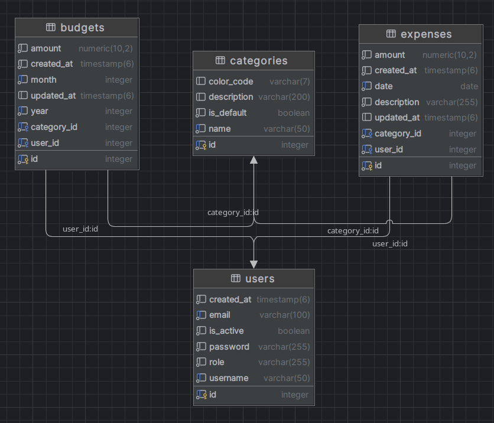

# Aplikacja Śledzenia Wydatków

## 1. Wprowadzenie

Expense Tracker to aplikacja zaprojektowana, aby pomóc użytkownikom śledzić i zarządzać swoimi wydatkami.
Zbudowana przy użyciu Spring Boot, aplikacja zapewnia platformę do rejestrowania wydatków, ustawiania budżetów, kategoryzowania wydatków oraz generowania raportów.
Aplikacja wykorzystuje Flyway do zarządzania migracjami bazy danych.

## 2. Struktura projektu

Aplikacja korzysta ze standardowej architektury Spring Boot z następującymi komponentami:

- **Controllers**: Obsługa żądań HTTP i definiowanie punktów końcowych API  
- **Services**: Zawierają logikę biznesową  
- **Repositories**: Zapewniają dostęp do danych  
- **Entities**: Definiują model danych 
- **DTOs**: Przenoszą dane między warstwami  
- **Configuration**: Konfigurują komponenty aplikacji  
- **Filters**: Implementują uwierzytelnianie JWT  

### 2.1 Diagram ERD bazy danych



## 3. Funkcje

- **Uwierzytelnianie i autoryzacja użytkowników na podstawie JWT**
  - Kontrola dostępu oparta na rolach (Role: User i Admin)  
  - Rejestracja i logowanie użytkowników  

- **Zarządzanie wydatkami**
  - Tworzenie, odczyt, aktualizacja i usuwanie wydatków  
  - Kategoryzacja wydatków  
  - Filtrowanie wydatków według zakresu dat, kategorii i kwoty  
  - Przegląd historii wydatków  

- **Zarządzanie budżetem**
  - Ustalanie miesięcznych budżetów według kategorii  
  - Śledzenie wykorzystania budżetu

- **Zarządzanie kategoriami**
  - Tworzenie niestandardowych kategorii wydatków  
  - Korzystanie z kategorii domyślnych  
  - Przypisywanie kolorów do kategorii  

- **Dashboard**
  - Podsumowania wydatków  
  - Analiza wydatków według kategorii  
  - Śledzenie miesięcznych trendów wydatków   

- **Funkcje administratora**
  - Zarządzanie użytkownikami (przeglądanie, zmiana statusu, usuwanie)  
  - Przegląd wszystkich wydatków i budżetów  
  - Dostęp do statystyk systemu  

## 4. Punkty końcowe API

### Uwierzytelnianie
- `POST /api/auth/login`: Logowanie użytkownika  
- `POST /api/auth/register`: Rejestracja użytkownika  

### Użytkownicy
- `GET /api/users`: Pobierz wszystkich użytkowników (tylko Admin)  
- `GET /api/users/{id}`: Pobierz użytkownika po ID (tylko Admin)  
- `GET /api/users/username/{username}`: Pobierz użytkownika po nazwie (tylko Admin)  
- `GET /api/users/profile`: Pobierz profil aktualnego użytkownika  
- `PUT /api/users/{id}/status`: Zmień status użytkownika (tylko Admin)  
- `DELETE /api/users/{id}`: Usuń użytkownika (tylko Admin)  
- `GET /api/users/stats`: Statystyki użytkowników (tylko Admin)  

### Wydatki
- `GET /api/expenses`: Pobierz wszystkie wydatki aktualnego użytkownika  
- `GET /api/expenses/all`: Pobierz wszystkie wydatki (tylko Admin)  
- `GET /api/expenses/{id}`: Pobierz wydatek po ID  
- `POST /api/expenses`: Utwórz nowy wydatek  
- `PUT /api/expenses/{id}`: Aktualizuj wydatek  
- `DELETE /api/expenses/{id}`: Usuń wydatek  
- `GET /api/expenses/current-month`: Wydatki bieżącego miesiąca  
- `GET /api/expenses/last-days/{days}`: Wydatki z ostatnich N dni  
- `GET /api/expenses/filter/date-range`: Filtrowanie wydatków po zakresie dat  
- `GET /api/expenses/filter/category/{categoryId}`: Filtrowanie według kategorii  
- `GET /api/expenses/filter/amount-range`: Filtrowanie po zakresie kwot  
- `GET /api/expenses/reports/total`: Łączna suma wydatków dla użytkownika  
- `GET /api/expenses/reports/total/period`: Suma wydatków dla wybranego okresu  
- `GET /api/expenses/reports/by-category`: Wydatki pogrupowane według kategorii  
- `GET /api/expenses/reports/monthly/{year}`: Miesięczne wydatki dla roku  
- `GET /api/expenses/stats`: Statystyki wydatków  

### Kategorie
- `GET /api/categories`: Pobierz wszystkie kategorie  
- `GET /api/categories/{id}`: Pobierz kategorię po ID  
- `POST /api/categories`: Utwórz nową kategorię  
- `PUT /api/categories/{id}`: Aktualizuj kategorię  
- `DELETE /api/categories/{id}`: Usuń kategorię  
- `GET /api/categories/default`: Pobierz kategorie domyślne  
- `GET /api/categories/custom`: Pobierz kategorie niestandardowe  
- `GET /api/categories/stats`: Statystyki kategorii  
- `POST /api/categories/initialize-defaults`: Inicjalizacja domyślnych kategorii  

### Budżety
- `GET /api/budgets`: Pobierz wszystkie budżety aktualnego użytkownika  
- `GET /api/budgets/all`: Pobierz wszystkie budżety (tylko Admin)  
- `GET /api/budgets/{id}`: Pobierz budżet po ID  
- `POST /api/budgets`: Utwórz nowy budżet  
- `PUT /api/budgets/{id}`: Aktualizuj budżet  
- `DELETE /api/budgets/{id}`: Usuń budżet  
- `GET /api/budgets/current-month`: Budżety bieżącego miesiąca  
- `GET /api/budgets/year/{year}`: Budżety według roku  
- `GET /api/budgets/period/{year}/{month}`: Budżety dla wybranego okresu  
- `GET /api/budgets/total/{year}/{month}`: Łączny budżet dla miesiąca  
- `GET /api/budgets/{id}/spent`: Wydana kwota dla budżetu  
- `GET /api/budgets/remaining/{categoryId}/{year}/{month}`: Pozostały budżet dla kategorii  
- `GET /api/budgets/stats`: Statystyki budżetów  

### Panel
- `GET /api/dashboard`: Podsumowanie panelu  
- `GET /api/dashboard/monthly/{year}`: Miesięczne wydatki  
- `GET /api/dashboard/overview`: Przegląd statystyk  
- `GET /api/dashboard/recent-activity`: Ostatnie aktywności  
- `GET /api/dashboard/budget-status`: Status budżetów  
- `GET /api/dashboard/trends/{months}`: Trendy wydatków  
- `GET /api/dashboard/category-breakdown`: Podział na kategorie  

### Inicjalizacja
- `POST /api/init/all`: Inicjalizuj wszystkie dane testowe  
- `POST /api/init/categories`: Inicjalizuj domyślne kategorie  
- `POST /api/init/users`: Inicjalizuj użytkowników testowych  
- `POST /api/init/expenses`: Inicjalizuj przykładowe wydatki  
- `POST /api/init/budgets`: Inicjalizuj przykładowe budżety  
- `POST /api/init/clear`: Wyczyść wszystkie dane  
- `GET /api/init/status`: Status danych  

## 5. Uruchamianie aplikacji

### Wymagania wstępne
- Java 17 lub wyższa  
- Docker i Docker Compose  
- Maven  

### Przy użyciu Dockera
1. Sklonuj repozytorium  
   ```bash
   git clone git@github.com:Sniezka1927/expense-tracker.git
   cd expense-tracker

2. Zbuduj aplikację przy użyciu Mavena

   ```bash
   ./mvnw clean package -DskipTests
   ```
3. Uruchom aplikację za pomocą Docker Compose

   ```bash
   docker compose up -d
   ```
4. Aplikacja będzie dostępna pod adresem [http://localhost:8080](http://localhost:8080)

  * Swagger UI: [http://localhost:8080/swagger-ui/index.html](http://localhost:8080/swagger-ui/index.html)

### Domyślni użytkownicy

Po inicjalizacji dostępni są następujący użytkownicy:

* Administrator: `admin` / `admin123`
* Zwykły użytkownik: `testuser` / `user123`
* Użytkownik demo: `demo` / `demo123`

## 6. Testowanie

Aplikacja zawiera kompleksowe testy jednostkowe dla kontrolerów i serwisów. Testy wykorzystują JUnit 5, Mockito oraz framework testowy Spring, aby zapewnić prawidłowe działanie aplikacji.

Pokrycie testami jest monitorowane za pomocą JaCoCo. Aby uruchomić testy i wygenerować raport pokrycia:

```bash
./mvnw clean test
```

Raport pokrycia będzie dostępny w `target/site/jacoco/index.html`.

## 7. Wzorce projektowe

W aplikacji wykorzystano następujące wzorce projektowe:

1. **MVC Pattern** – separacja logiki aplikacji na entity, serwis i Controller
2. **Repository Pattern** – abstrakcja dostępu do danych
3. **DTO (Data Transfer Object)** – transfer danych między warstwami
4. **Adapter Pattern** – konwersja między encjami a DTO
5. **Singleton Pattern** – dla serwisów i repozytoriów